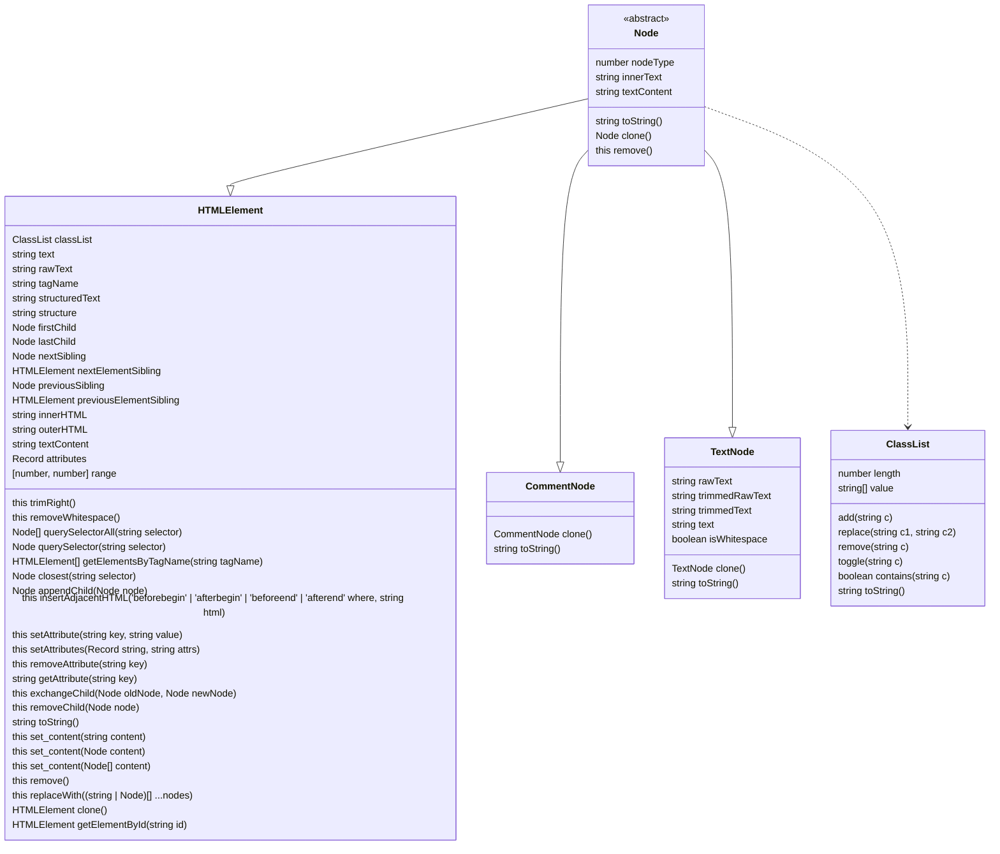

# Fast HTML Parser

Fast HTML Parserは、_非常に高速な_HTMLパーサーです。要素のクエリをサポートする、簡略化されたDOMツリーを生成します。

設計上、巨大なHTMLファイルを最小限のコストで解析することを意図しているため、パフォーマンスが最優先されています。このため、一部の不正な形式のHTMLは正しく解析できない場合がありますが、一般的なエラーのほとんどはカバーされています（例：HTML4スタイルの閉じタグのない `<td>` など）。

## Usage

```ts
import { HTMLParser } from 'https://code4fukui.github.io/node-html-parser/HTMLParser.js';

const root = HTMLParser.parse('<ul id="list"><li>Hello World</li></ul>');

console.log(root.firstChild.structure);
// ul#list
//   li
//     #text

console.log(root.querySelector('#list'));
// { tagName: 'ul',
//   rawAttrs: 'id="list"',
//   childNodes:
//    [ { tagName: 'li',
//        rawAttrs: '',
//        childNodes: [Object],
//        classNames: [] } ],
//   id: 'list',
//   classNames: [] }
console.log(root.toString());
// <ul id="list"><li>Hello World</li></ul>
root.set_content('<li>Hello World</li>');
root.toString();	// <li>Hello World</li>
```

## How to build

```sh
npm i
deno bundle dist/index.ts > bundle.js
```

## Performance

-- 2022-08-10

```shell
html-parser     :24.1595 ms/file ± 18.7667
htmljs-parser   :4.72064 ms/file ± 5.67689
html-dom-parser :2.18055 ms/file ± 2.96136
html5parser     :1.69639 ms/file ± 2.17111
cheerio         :12.2122 ms/file ± 8.10916
parse5          :6.50626 ms/file ± 4.02352
htmlparser2     :2.38179 ms/file ± 3.42389
htmlparser      :17.4820 ms/file ± 128.041
high5           :3.95188 ms/file ± 2.52313
node-html-parser:2.04288 ms/file ± 1.25203
node-html-parser (last release):2.00527 ms/file ± 1.21317
```

[htmlparser-benchmark](https://github.com/AndreasMadsen/htmlparser-benchmark) でテストされています。

## Global Methods

### parse(data[, options])

提供されたデータを解析し、生成されたDOMのルートを返します。

- **data**: 解析するデータ
- **options**: 解析オプション

  ```js
  {
    lowerCaseTagName: false,		// タグ名を小文字に変換する（パフォーマンスを大きく損ないます）
    comment: false,           		// コメントを取得する（パフォーマンスをわずかに損ないます）
    fixNestedATags: false,    		// 無効なネストされた <a> HTMLタグを修正する
    parseNoneClosedTags: false, 	// 閉じられていないHTMLタグを削除する代わりに閉じる
    voidTag: {
      tags: ['area', 'base', 'br', 'col', 'embed', 'hr', 'img', 'input', 'link', 'meta', 'param', 'source', 'track', 'wbr'],	// 省略可能、大文字小文字を区別しない。デフォルト値は ['area', 'base', 'br', 'col', 'embed', 'hr', 'img', 'input', 'link', 'meta', 'param', 'source', 'track', 'wbr']
      closingSlash: true	// 省略可能、デフォルトは false。空要素タグのシリアライズ時に、最後にスラッシュを追加する <br/>
    },
    blockTextElements: {
      script: true,		// 解析時にテキストコンテンツを保持する
      noscript: true,		// 解析時にテキストコンテンツを保持する
      style: true,		// 解析時にテキストコンテンツを保持する
      pre: true			// 解析時にテキストコンテンツを保持する
    }
  }
  ```

### valid(data[, options])

提供されたデータを解析し、指定されたデータが有効な場合は true を返し、そうでない場合は false を返します。

## Class



## HTMLElement Methods

### trimRight()

TextNode内でパターンを検出した後、右側から（ブロック内で）要素をトリミングします。

### removeWhitespace()

このサブツリー内の空白を削除します。

### querySelectorAll(selector)

CSSセレクターをクエリして、一致するノードを検索します。

注: v3.0.0以降、CSS3セレクターの全範囲がサポートされています。

### querySelector(selector)

CSSセレクターをクエリして、一致するノードを検索します。見つからない場合は `null` を返します。

### getElementsByTagName(tagName)

指定された tagName を持つすべての要素を取得します。

注: すべての要素を取得するには * を使用します。

### closest(selector)

CSSセレクターによって最も近い要素をクエリします。見つからない場合は `null` を返します。

### before(...nodesOrStrings)

現在の要素の前に1つまたは複数のノードまたはテキストを挿入します。ルートでは機能しません。

### after(...nodesOrStrings)

現在の要素の後に1つまたは複数のノードまたはテキストを挿入します。ルートでは機能しません。

### prepend(...nodesOrStrings)

要素の子ノードの最初の位置に、1つまたは複数のノードまたはテキストを挿入します。

### append(...nodesOrStrings)

要素の子ノードの最後の位置に、1つまたは複数のノードまたはテキストを挿入します。
これは appendChild に似ていますが、任意の数のノードを受け入れ、文字列をテキストノードに変換します。

### appendChild(node)

要素の子ノードにノードを追加します。

### insertAdjacentHTML(where, html)

指定されたテキストをHTMLとして解析し、結果のノードをDOMツリーの指定された位置に挿入します。

### setAttribute(key: string, value: string)

`key` 属性に `value` を設定します。

### setAttributes(attrs: Record<string, string>)

要素の属性を設定します。

### removeAttribute(key: string)

`key` 属性を削除します。

### getAttribute(key: string)

`key` 属性を取得します。設定されていない場合は `undefined` を返します。

### exchangeChild(oldNode: Node, newNode: Node)

指定された子ノードを新しい子ノードと交換します。

### removeChild(node: Node)

子ノードを削除します。

### toString()

[outerHTML](#htmlelementouterhtml) と同じです。

### set_content(content: string | Node | Node[])

コンテンツを設定します。**注意**: **ルート**ノードのコンテンツは設定しないでください。

### remove()

現在の要素を削除します。

### replaceWith(...nodes: (string | Node)[])

現在の要素を他のノードに置き換えます。

### classList

#### classList.add

クラス名を追加します。

#### classList.replace(old: string, new: string)

クラス名を別のものに置き換えます。

#### classList.remove()

クラス名を削除します。

#### classList.toggle(className: string):void

クラスを切り替えます。すでに含まれている場合は削除し、そうでない場合は追加します。

#### classList.contains(className: string): boolean

クラス名がすでに classList に存在する場合は true を返します。

#### classList.value

クラス名を取得します。

#### clone()

ノードを複製します。

#### getElementById(id: string): HTMLElement | null

IDによって要素を取得します。

## HTMLElement Properties

### text

現在のノードとその子ノードのアンエスケープされたテキスト値を取得します。`innerText` のようなものです。（初回は遅いです）

### rawText

現在のノードとその子ノードのエスケープされた（そのままの）テキスト値を取得します。`&amp;` が含まれる場合があります。（高速です）

### tagName

HTMLElementのタグ名を取得または設定します。戻り値は大文字の文字列であることに注意してください。

### structuredText

構造化されたテキストを取得します。

### structure

DOM構造を取得します。

### childNodes

すべての子ノードを取得します。子ノードには、TextNode、CommentNode、およびHTMLElementがあります。

### children

すべての子要素、つまり HTMLELement 型のすべての子ノードを取得します。

### firstChild

最初の子ノードを取得します。ノードに子がない場合は `undefined` を返します。

### lastChild

最後の子ノードを取得します。ノードに子がない場合は `undefined` を返します。

### firstElementChild

HTMLElement型の最初の子を取得します。存在しない場合は `undefined` を返します。

### lastElementChild

HTMLElement型の最後の子を取得します。存在しない場合は `undefined` を返します。

### childElementCount

HTMLElement型の子の数を取得します。

### innerHTML

innerHTMLを取得または設定します。

### outerHTML

outerHTMLを取得します。

### nextSibling

現在の要素の親の次の子ノードへの参照を返します。見つからない場合は `null` を返します。

### nextElementSibling

現在の要素の親の次の子要素への参照を返します。見つからない場合は `null` を返します。

### previousSibling

現在の要素の親の前の子ノードへの参照を返します。見つからない場合は `null` を返します。

### previousElementSibling

現在の要素の親の前の子要素への参照を返します。見つからない場合は `null` を返します。

### textContent

現在の要素の textContent を取得または設定します。[set_content](#htmlelementset_contentcontent-string--node--node) よりも効率的です。

### attributes

現在の要素のすべての属性を取得します。**注意: 戻り値を変更しようとしないでください。**

### range

対応するソースコードの開始インデックスと終了インデックス（例: [ 0, 40 ]）
